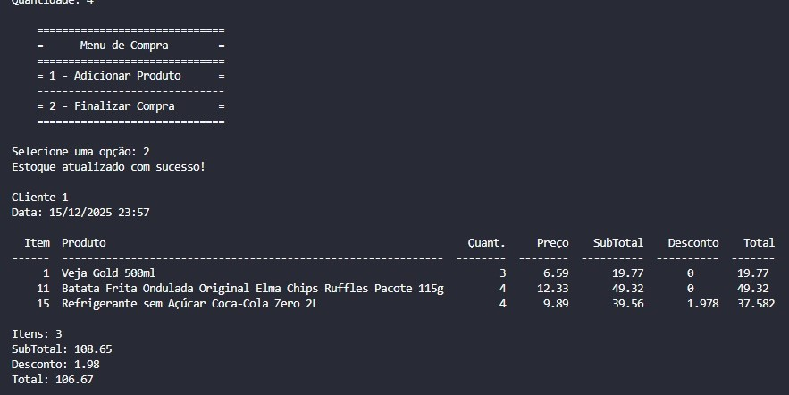

# Projeto de Conclusão de disciplina Python e Dados.


## 🛒 Projeto Sistema de Caixa e Administração de Supermercado 
Este projeto é um sistema de supermercado desenvolvido em Python, 
que simula tanto o caixa (checkout de compras) quanto a administração/gestão do mercado. Ele foi criado com foco em boas práticas, 
orientação a objetos, persistência de dados e análise de informações, servindo como um projeto de estudo e portfólio.

# Funcionalidades do Sistema
## 👥 Área de Caixa (Checkout)
- Registro de compras

- Cálculo automático do valor total

- Aplicação de descontos (após uma determinada quantidade comprada)

- Atualização de estoque após a venda

- Validação de quantidade disponível em estoque

## 🔐 Área administrativa SIG (restrita)
- Gerenciar produtos, clientes, fornecedores e descontos.

- Controlar estoque e preços.

- Gerar consultas e relatórios utilizando pandas

- Logs de alteração de preços e de falta de estoque

O sistema busca unir lógica de negócio, persistência em banco de dados e manipulação de dados em um único projeto.

## 🛠️ Tecnologias Utilizadas
- **Python** – Linguagem principal.

- **Pandas** – Consultas, relatórios e análise de dados.

- **SQLAlchemy** – Mapeamento Objeto-Relacional (ORM) para facilitar o acesso e salvamento ao banco de dados.

- **Web Scraping** – Pegar dados já existentes de um mercado fictício.

- Leitura de arquivos:
-- JSON
-- CSV
-- Excel
-- TXT

- Orientação a Objetos (OOP)

### Modelagem de Dados (SQLAlchemy) para SQLite
## Principais entidades mapeadas:

- **Cliente** (id_cliente, nome)

- **Produto** (id_produto, id_desconto, nome, quantidade, preco, quantidade_min_para_desconto)

- **Compra** (id_compra, id_cliente, data_hora, Estado, Cidade, Rua, Número, Complemento)

- **Item** (id_item, id_compra, id_produto, id_desconto, quantidade, preco_unitario, i, Status)
  
- **Fornecedor** (id_fornecedor, nome)

- **Desconto** (id_desconto, tier, percentual)

## 📁 Estrutura do Projeto
```Code
Administrador-Caixa-Supermercado-Python/
│
├── Common/                    # Classes e funções compartilhadas
├── Mercado_Caixa/             # Lógica do caixa (checkout)
├── Mercado_SIG_Administracao/ # Administração e gestão
├── Documentacao/              # Documentação do projeto
├── main-Caixa.py              # Arquivo principal do caixa
├── main_SIG.py                # Arquivo principal da administração
├── requirements.txt           # Dependências do projeto
└── README.md
```
## ▶️ Como Executar o Projeto
## 1 Clonar o repositório
```Git Clone
git clone https://github.com/Richard-Alves167/Administrador-Caixa-Supermercado-Python.git
cd Administrador-Caixa-Supermercado-Python
```

## 2 Instalar as dependências
```Pip Install
pip install -r requirements.txt
```

## 3 Executar o sistema
### **Caixa**:
```Caixa
python main-Caixa.py
```

### **Administração**:
```Administração SIG
python main_SIG.py
```

### 🧠 Conceitos Aplicados

- Programação Orientada a Objetos (encapsulamento, responsabilidades)

- Separação de camadas (caixa vs administração)

- Persistência de dados com ORM

- Manipulação e análise de dados com pandas

- Boas práticas de organização de código
